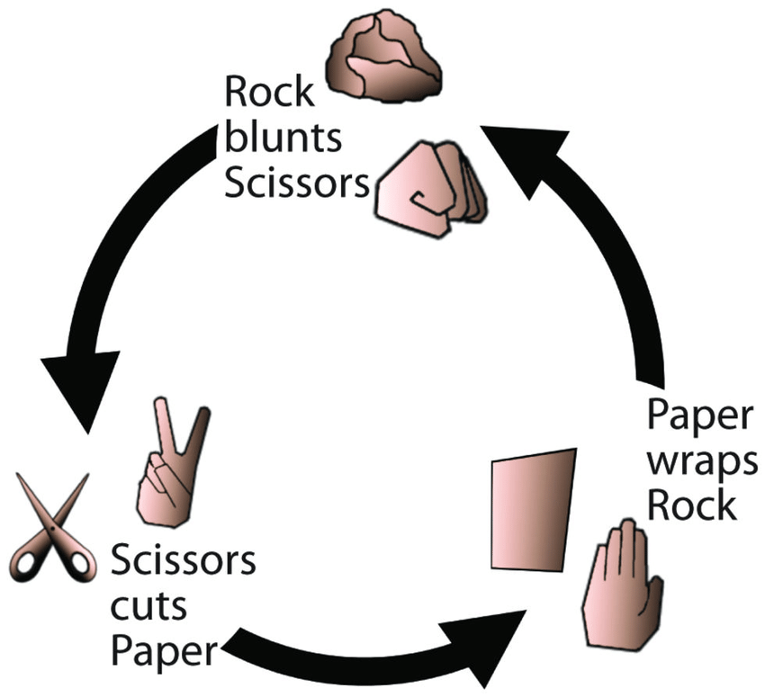

# Rock Paper Scissors

***It is a game in which two players select either rock, paper or scissors.
According tho the principles of the game, rock beats scissors, scissors beats paper
and paper beats rock. 
In fact, the game will be played over 5 rounds. In each round, a computer randomly selects
one of those options. And the player should also select one of them. Besides, the player
should guess the computer selection in order to win. 
In addition, the scores are calculated and kept in each round. At the end, the scores are compared.
and a winner or loser is defined. If the scores are the same, the result becomes a draw.***

---

## The technique of the game is explained in the image below:
 

---

## **Languages**
 

 JavaScript 100.0%

---

 

[Please click here to play the game in the browser](https://xoshbaxt.github.io/main-assignment3/)

 
